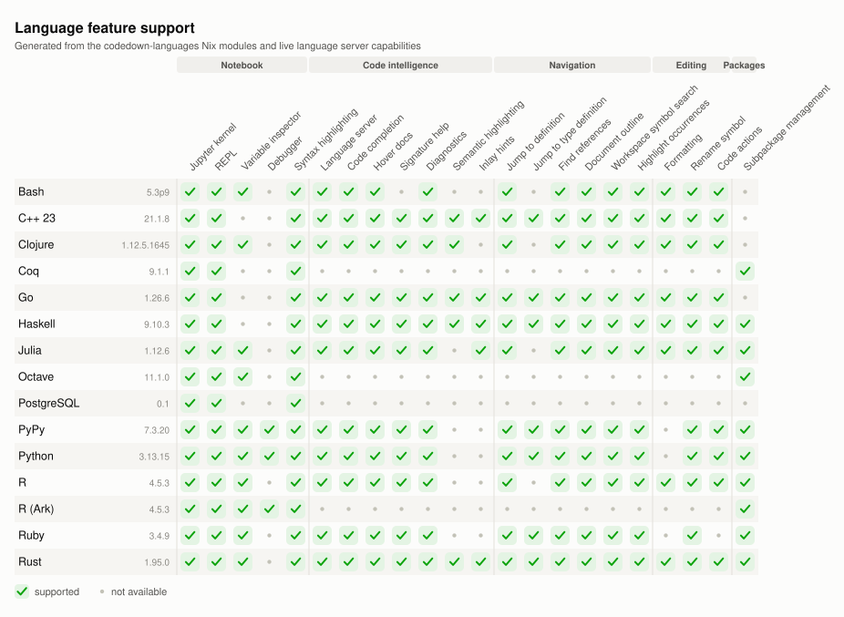

# codedown-languages

Nix modules that build reproducible language environments: one declarative config gives you
a Jupyter kernel, a language server, package management, and the notebook features that hang
off them, for every language listed below.

See the available options in [OPTIONS.md](./OPTIONS.md).

<!-- BEGIN FEATURE MATRIX -->

<picture>
  <source media="(prefers-color-scheme: dark)" srcset="docs/feature-matrix-dark.svg">
  
</picture>

<!-- END FEATURE MATRIX -->
